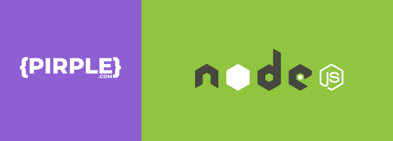

# Node.js Masterclass



## Uma Breve Introdução

Este projeto/repositório é baseado no curso Node.JS Masterclass da Pirple. Adquiri este curso em uma oferta irrisória de R$ 10,00 em Junho de 2021.

A proposta do curso é passar por todos os módulos da documentação do Node.js e aplicar na criação de um projeto sem nenhum framework.

A grade básica é apresentada abaixo.

- [x] Welcome and Background Information
  - v8, backend javascript
- [x] Building a RESTful API
  - http, https, requests, headers, payload, request, json, query strings
- [x] Building a Web App GUI
  - dom api
- [x] Background Workers
  - log system, gzip
- [x] Building a CLI
  - readline
- [x] Performance and Stability
  - cluster, child process, performance hooks
- [x] Loose Ends
  - http2, vm, tls/ssl, udp, repl, async hooks

Embora passe por boa parte dos módulos do Node.js, o conteúdo do curso não está atualizado e é baseado em uma versão 8 do Node.js.

Para aprender Node.js hoje eu não aconselharia você a comprar este curso. Existem opções melhores como o [Ignite da Rocketseat](https://www.rocketseat.com.br/ignite), o curso do [Eric Wendel](https://cursos.erickwendel.com.br/) os cursos do [Manguinho](https://rmanguinho.github.io/). Existem boas opções tanto no [Youtube](https://www.youtube.com/) como no [freeCodeCamp](https://www.freecodecamp.org/).

## A oportunidade

Mas do limão uma limonada.

Sempre existe uma oportunidade. Olhando os módulos resolvi aproveitar os ensinamentos do curso e impor um desafio a mim mesmo de colocar em prática uma refatoração pesada em todos o módulos com a versão mias recente do Node.js (versão 18 em maio de 2022).

Seguindo a premissa original, não utilizei frameworks. Apenas instalei o `dotenv` e o `dotenv-expand` para configuração das variáveis de ambiente e o `nodemon` para restart automático no módulo de desevolvimento. Estes móduos não instalam nenhuma dependência adicional

O código original pode ser visto neste repositório [NodeJS Masterclass](https://github.com/pirple/The-NodeJS-Master-Class).

Posso dizer que isto foi muito bom para aprimorar meus conhecimentos e que estou bastante feliz com o aprendizado.

## O desafio

A api original era baseada em callbacks e chega a ter até 6 níveis de profundidade, em um padrão conhecido como callback hell. A leitura do código era difícil.

Como exemplo você pode ver o código original da lib de acesso ao sistema de arquivos (que no curso é usada como a base dados) original

```js
// Update data in a file
lib.update = function (dir, file, data, callback) {
  // Open the file for writing
  fs.open(
    lib.baseDir + dir + "/" + file + ".json",
    "r+",
    function (err, fileDescriptor) {
      if (!err && fileDescriptor) {
        // Convert data to string
        var stringData = JSON.stringify(data)

        // Truncate the file
        fs.truncate(fileDescriptor, function (err) {
          if (!err) {
            // Write to file and close it
            fs.writeFile(fileDescriptor, stringData, function (err) {
              if (!err) {
                fs.close(fileDescriptor, function (err) {
                  if (!err) {
                    callback(false)
                  } else {
                    callback("Error closing existing file")
                  }
                })
              } else {
                callback("Error writing to existing file")
              }
            })
          } else {
            callback("Error truncating file")
          }
        })
      } else {
        callback("Could not open file for updating, it may not exist yet")
      }
    }
  )
}
```

e refatorado usando fs/promises e async/await

```js
async function fileUpdate(dir, file, data) {
  let fileHandle
  try {
    fileHandle = await fs.open(path.join(baseDir, dir, `${file}.json`), "r+")
    await fileHandle.truncate()
    await fileHandle.writeFile(JSON.stringify(data))
  } catch (e) {
    debug(e.message)
  } finally {
    fileHandle?.close()
  }
}
```

As requisição a api, no caso do frontend, era feita através de XMLHttpRequest e no backend o request era feito usando o Request, agora [depreciado](https://github.com/request/request/issues/3142). Ambas foram substituídas pelo novo módulo fetch do Node.js.

Optei por usar o máximo possível promises e async/await na construção do código. Também alterei o status de algumas das respostas da api para os quais acredito que sejam mais adequados.

No módulo de testes fiz uma pequena experiência com o test runner do Node.js 18 mas não ampliei para os testes da api.

Como o curso não tem base em TDD e não é focado em testes, a api não tem uma cobertura de testes adequada e não pude verificar se o funcionamento é exatamente igual ao do curso. Podem existir detalhes da implementação levemente diferentes.

O código original do frontend foi pouco refatorado, é desestruturado e confuso. O objetivo é melhorá-lo em breve, usando vanilla Javascript, sem frameworks.

Como desafio final na parte da api, apliquei o design pattern Model-View-Controller (MVC).

## Conclusões

Espero que sirva de inpiração para seus desafio e qualquer comentário ou melhoria é so fazer um PR que eu avalio para eu aprender com as sugestões também.

## O que poderá ser feito (sem compromisso)

- [ ] Melhorias do layout da web GUI usando técnicas simples com display flex
- [ ] Refatoração do código do frontend usando módulos, separando as responsabilidades.
- [ ] Roteamento baseado em páginas no frontend (similar ao Next)
- [ ] Middlewares para validação e autenticação na api

## Notas gerais

### Geração do certificado do servidor

```bash
openssl genrsa -out key.pem
```

```bash
openssl req -new -key key.pem -out csr.pem
```

```bash
openssl x509 -req -days 9999 -in csr.pem -signkey key.pem -out cert.pem
rm csr.pem
```
